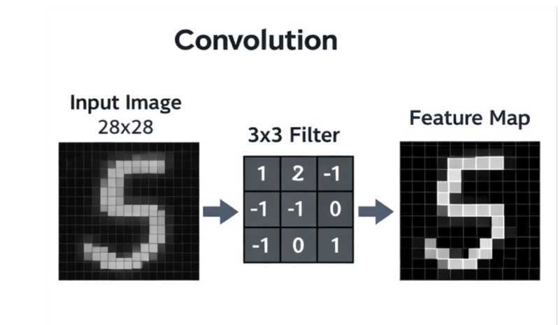
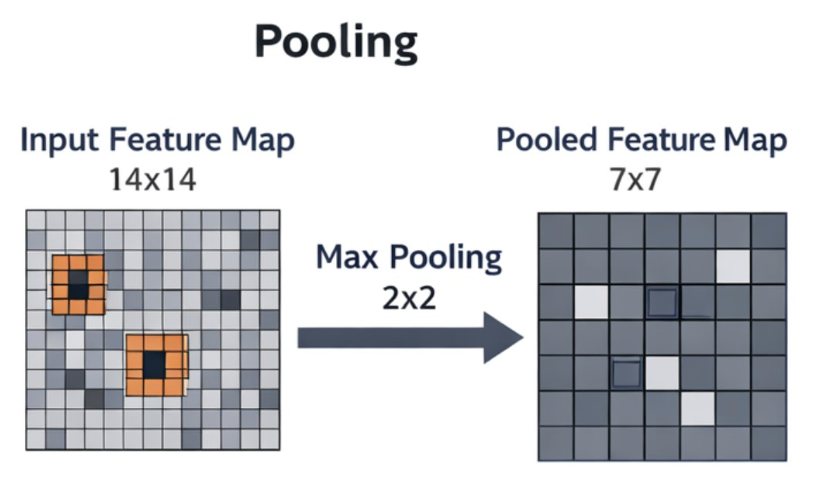
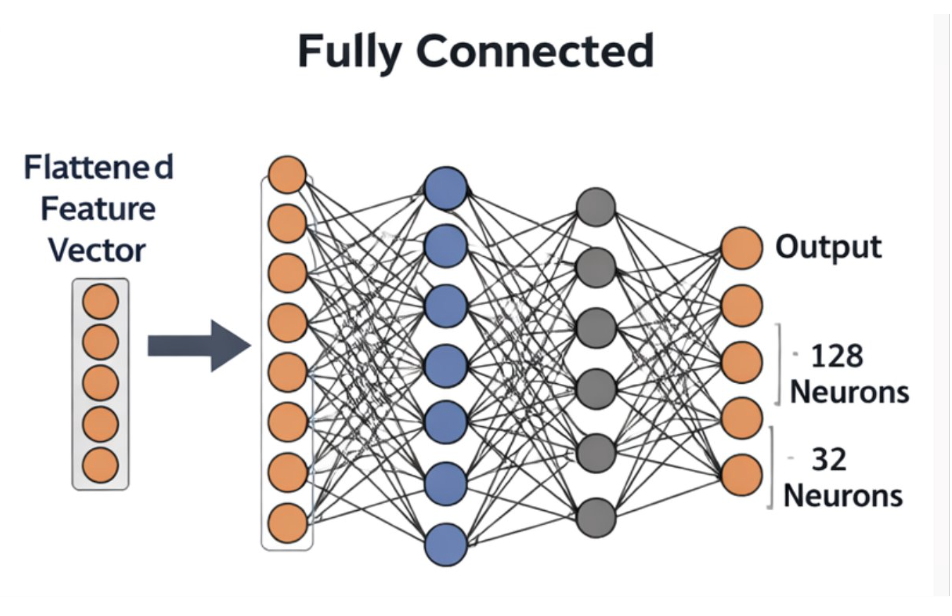
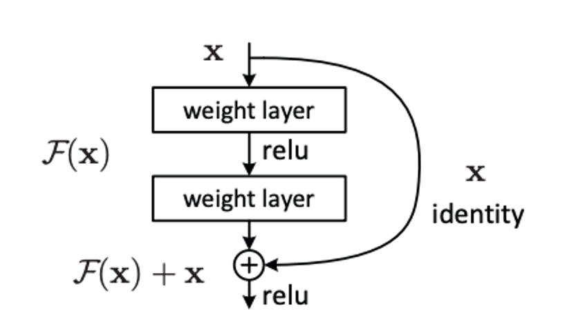

# Convolutional Neural Networks {#sec-cnn}

## Introduction to CNNs

So far in this course the neural networks we have mostly been working with have been types of Multilayer Perceptron (MLPs). These foundational neural networks are not suited to all types of problem. One such example involves images, i.e. a set of pixels - these will be treated independently which will ignore powerful features such as locality. To tackle this issue, Convolutional Neural Networks were devised. 

## How do CNNs work

The building blocks of a CNN are:

* Convolutional Layer
* Activation Layer
* Pooling Layer
* Fully connected layer

### Convolutional Layer

This layer performs the core mathematical function - a *sliding window* is shiftd across the image looking for specific *features*. These sliding windows are called *filters* or *kernels* and there are several which are each looking for different patterns e.g. straight lines or curves.
The filters highlight the specific pattern they are looking for and create a *feature map*. 
Activation functions are used to ensure non-linear transformations are possible in the network, e.g. by ReLu is commonly used in the convolutional layers in a CNN.

{#fig-cnnlayer}

### Pooling Layer

This layer's primary purpose is to identify the most significant features and reduce the size of the feature maps. A filter is used which scans over the feature map and aggregation functions are used to reduce the dimensionality of the data.
Types of aggregation function include:

* Max Pooling: Selects the maximum value from the area of the feature map covered by the filter
* Average Pooling: Calculates the average value within the area of the feature map and uses this to select significant features

{#fig-cnnpooling}

### Fully connected Layer

This layer is there to assign final predictions based on the outputs of the previous convolution and pooling layers. Each node in this layer is connected to each node in the previous layer. In a classification task the activation function is typically SoftMax, which turns the flatted vector of features into a probability distribution. 

{#fig-cnnconnected}

## CNN parameters

### Stride

The stride is the number of pixels that the convolutional filter moves each time it starts a new pass. A stride of 1 means one pixel at a time, 2 means two pixels at a time etc. 
This parameter has an important effect on the performance of a CNN. Larger strides reduce spatial dimensions of the output feature map, while increasing computational efficiency. However they can also miss fine-grained features while capturing the broad ones. 

### Padding

In fixed size images there will be edges of the image where the convolutional filter can not be applied; this can lead to a loss of information. 
Padding adds extra pixels around the image, usually just zeros, which allow the filter to be applied - without adding artifical information.

## Limitations of CNNs

CNNs, although very powerful for datasets composed of images, do have their limitations. The networks are frequently complex which take significant resources to train, along with having to use large datasets to be performant. Another issue that commonly occurs is known as the *vanising gradient problem* which occurs with deeper networks. As the gradients become smaller between layers it becomes more difficult for earlier layers to learn. 
In fact it was shown that deeper networks, which were orignally thought to be more performant, were actually exhibiting signs of poorer performance than shallower ones, with higher training and test errors. 

## Deep Residual Learning

In 2015 a paper was published which redefined how we use CNNs (https://www.cv-foundation.org/openaccess/content_cvpr_2016/papers/He_Deep_Residual_Learning_CVPR_2016_paper.pdf).
It proposed a new structure to CNNs which helped to alleviate some of the issues described above. They key shift was to use *skipped connections* to speed up training, which also had the benefit of preventing the vanishing gradient problem. 

### ResNet basic idea

The idea behind this network architecture can be described simply mathematically. Instead of learning:

$$
\begin{align}
y=f(x)
\end{align}
$$

the network learns

$$
\begin{align}
y=f(x) + x.
\end{align}
$$

The network learns the *correction* needed for the mapping rather than the full mapping itself. If we consider a simple mapping of:

$$
\begin{align}
y=x
\end{align}
$$

a standard network will try to learn:

$$
\begin{align}
f(x)=x
\end{align}
$$

rather than 

$$
\begin{align}
f(x)=0
\end{align}
$$
.

**It is easier for the network to learn f(x)=0 than learn how to map the identity function directly.**

### Skipped connections

The identity function is a key concept in residual networks. By using *shortcut connections* or *skipped connections* - which perform identity mapping - the outputs can be added to the outputs of intermediate layers. The original x is copied forward unchanged and new features are added to this - *corrections*. 

{#fig-reslearning}

To summarise, with a standard CNN each layer is relearning lots of information again and has to re-encode this information. Using a ResNet architecture keeps previous information and only learns what has *changed*. 