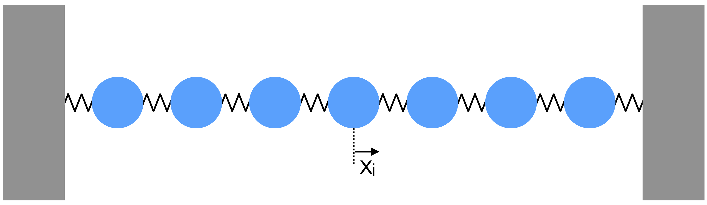

A square NxN matrix $A$, has eigenvector $u$ and eigenvalue $\lambda$ that satisfy :

$$(A - \lambda I)u = 0$$  {#eq-a}

Solving eigenproblems is closely related to finding the roots of polynomials. You may be familiar with one method for finding eigenvalues, which is to find the roots of the N-th degree polynomial found by expanding :

$$p(t) = \det{|A - t I|} = 0$$ {#eq-b}

Many eigenproblem solving routines are provided by SciPy. In particular, `scipy.linalg.eig(A)` will return a tuple containing the eigenvalues and eigenvectors of A.  If only the eigenvalues are required, `scipy.linalg.eigenvals(A)` can be used.

Care should be taken when using `scipy.linalg.eig`, since it will find "left" and "right" eigenvectors, as specified, which are the solutions to $v A = \lambda v$ and $A v = \lambda v$ respectively.

For further details see [scipy.linalg.eig](https://docs.scipy.org/doc/scipy/reference/generated/scipy.linalg.eig.html)

Additional routines include :

- [scipy.linalg.eigh](https://docs.scipy.org/doc/scipy/reference/generated/scipy.linalg.eigh.html) (for Hermitian matrices)

- [scipy.linalg.eig_banded](https://docs.scipy.org/doc/scipy/reference/generated/scipy.linalg.eig_banded.html) (for banded matrices)

- [scipy.sparse.linalg.eigs](https://docs.scipy.org/doc/scipy/reference/generated/scipy.sparse.linalg.eigs.html) (for sparse, square symmetric matrices)

## Simple example

We can test these sovlers using the matrix :

$$A = 
\pmatrix{
-2 & -4 & 2 \\
-2 &  1 & 2 \\
4  &  2 & 5}
$$  {#eq-c}

for which the eigenvalues are $\lambda^{(0)}=6$, $\lambda^{(1)}=-5$, $\lambda^{(2)}=3$.

Note that the algorithms discussed here will all find _unit_ eigenvectors.  The eigenvector corresponding to $\lambda^{(0)}$ is then :

$$\hat{u}^{(0)}=\pmatrix{\frac{1}{\sqrt{293}} \\
\frac{6}{\sqrt{293}} \\
\frac{16}{\sqrt{293}}
}
=
\pmatrix{0.058 \\
0.351 \\
0.935}$$  {#eq-d}

with numerical values given to 3 decimal places on the RHS.

```{python}
import numpy as np
import scipy.linalg as linalg

m = np.array([[-2,-4,2],[-2,1,2],[4,2,5]])

# set seed for repeatability
np.random.seed(2)

# run the algorithm
mus, vs = linalg.eig(m)

# print results
np.set_printoptions(precision=3)
for i in range(3):
    print("Eigenvalue/vector : {:.1f} {}".format(mus[i], vs.T[i]))
```

Which includes the solution expected.

Note that we have transposed the array of eigenvectors returned by `linalg.eig()`. This is a feature of the function, as described in the reference manual : _"The normalized left eigenvector corresponding to the eigenvalue `w[i]` is the column `vl[:,i]`"_.

## Physics Example

In this section, we illustrate the use of eigenvalue solvers in finding stable solutions of the coupled system of oscillators shown below.



If the displacement of the $i$th mass from its equilibrium position is denoted as $x_i$, the force on the mass is given by the tension in the two springs as :

$$F_i = −k(x_i − x_{i−1}) + k(x_{i+1} − x_i) = −k(2x_i − x_{i−1} − x_{i+1})$$  {#eq-e}

We can assume that there are normal mode solutions, i.e. solutions of the form $x_i = z_i e^{i\omega t}$ in which all masses oscillate with the same frequency $\omega$ but with unknown phasors $z_i$. Then the above equation becomes :

$$F_i = m\ddot{x}_i = −m\omega^2x_i = −k(2x_i − x_{i−1} − x_{i+1})$$  {#eq-f}

This is one row of a matrix equation describing the entire system :

$$m\omega^2x_i \left(\begin{array}{c} \vdots \\ \\ x_i \\ \\ \vdots \end{array}\right) = 
\left(\begin{array}{ccccccc} & & & \vdots & & & \\ \cdots & 0 & -1 & 2 & -1 & 0 & \cdots \\ & & & \vdots & & & \end{array}\right)
\left(\begin{array}{c} \vdots \\ x_{i-1} \\ x_i \\ x_{i+1} \\ \vdots \end{array}\right)
$$  {#eq-g}

This example is a typical eigenvalue problem, in that many of the matrix elements are zero, which can greatly simplify the computational challenge and make even large systems solvable. The matrix is symmetric, which means it is suitable for solving with our eigenproblem solving function above, or one of the solvers from `scipy.linalg`.

```{python}
m = np.array([[2, -1,  0,  0,  0,  0,  0],
              [-1, 2, -1,  0,  0,  0,  0],
              [0, -1,  2, -1,  0,  0,  0],
              [0,  0, -1,  2, -1,  0,  0],
              [0,  0,  0, -1,  2, -1,  0],
              [0,  0,  0,  0, -1,  2, -1],
              [0,  0,  0,  0,  0, -1,  2]])

mus, vs = linalg.eig(m)
```

The eigenvalue associated with each mode gives the frequency, while the (complex) eigenvector provides the magnitude and phase of oscillation for each mass. We can plot the displacement of each mass as a function of time for each mode.

```{python}
import numpy as np
import scipy.linalg as linalg
import matplotlib.pyplot as plt

# a function to calculate the (real) displacement from complex phase
def disp(zi, omega, t):
    return np.real(zi * np.exp(1j * omega * t))

# set up some pretty colours for plotting
cm  = plt.cm.viridis
col = [cm(int(x*cm.N/7)) for x in range(7)]

# time period
ts = np.arange(0,40, 0.001)

# loop over eigenmodes
for i in range(7):
    
    print("Mode       : ",i)
    print("Eigenvalue : ", mus[i])

    fig=plt.figure(figsize=(16, 4))

    xs = []
    
    # loop over masses
    for j in range(7):
        
        # get the displacement, and add an offset to separate out each line
        offset = (2*j)-6
        
        # create displacement values from function using eigenvectors and eigenvalues
        xs     = disp(vs.T[i][j], mus[i], ts) + offset
        
        # plot displacement
        plt.plot(ts, xs, color=col[j])
        
        # plot central position to guide the eye
        plt.plot([0, 40], [offset, offset], color=col[j], linestyle='dotted') 

    plt.xlabel("t")
    plt.show()
```


